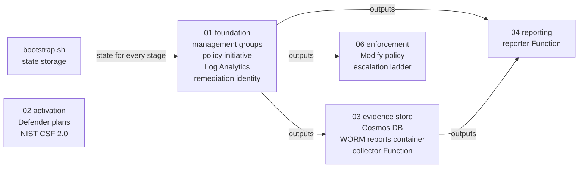
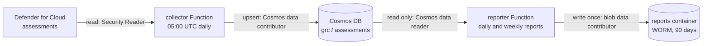

# Architecture

This pipeline turns Azure's own security signals into evidence I can defend.
Defender for Cloud and Azure Policy find the problems. A collector records every
result in a database I own. Report generators turn those records into a POA&M and
a SAR that can't be changed after they're written. Azure Policy repairs what it
can, and repairs to existing resources wait for a human to approve them. Nearly
all of it is Terraform in this repo (the exceptions are listed below), deployed in
stages, and every change goes through a pull request that the pipeline's own gate
has to pass.

The course's optional Stage 5 (an AI-written narrative) isn't built. The stage
numbers still match the course, so there is no `05` directory.

## Stage flow

Each stage is its own Terraform root module with its own state file. A stage reads
another stage only through that stage's outputs (`terraform_remote_state`), never
through its internals. The outputs are the contract between stages.

Solid arrows show which stage reads which stage's outputs. Stage 02 reads no
other stage, so it could deploy any time after the bootstrap; I deploy in numeric
order.

| Stage | State file | What it owns | Reads | CI coverage |
|---|---|---|---|---|
| [`bootstrap.sh`](../labs/03-foundation/bootstrap.sh) | none (it creates the state store) | `rg-grc-tfstate` and the state storage account: versioned, TLS 1.2, no public access. Terraform reaches it with Entra ID, not account keys | nothing | none (run once, by hand) |
| [`01-foundation`](../stages/01-foundation) | `01-foundation.tfstate` | `mg-grc` -> `mg-grc-sandbox` -> subscription, the sandbox and evidence resource groups, `law-grc-sandbox`, the six-policy initiative assigned at `mg-grc-sandbox`, the remediation identity | nothing | gate and drift |
| [`02-activation`](../stages/02-activation) | `02-activation.tfstate` | Defender for Storage and Defender for Key Vault at Standard, the NIST CSF 2.0 assignment on the subscription | nothing | none yet ([gap 1](#known-gaps-and-trade-offs)) |
| [`03-evidence-store`](../stages/03-evidence-store) | `03-evidence-store.tfstate` | Cosmos DB (`grc` database: `assessments`, `frameworks`, `mappings`), evidence storage with the WORM `reports` container, the collector Function App | 01 | gate and drift |
| [`04-reporting`](../stages/04-reporting) | `04-reporting.tfstate` | the reporter Function App | 01, 03 | gate and drift |
| [`06-enforcement`](../stages/06-enforcement) | `06-enforcement.tfstate` | the `cge-fix-public-blob` Modify policy, the `remediation_mode` ladder, the remediation identity's storage role | 01 | gate and drift |

Function code isn't Terraform. After stages 03 and 04 apply, the collector and
report code deploy with `az functionapp deployment source config-zip`.

### What lives outside Terraform

A few pieces were created by script or by hand in the early labs. They are listed
here so nothing is invisible:

| Piece | Created by | Why it isn't in Terraform |
|---|---|---|
| Terraform state storage | [`bootstrap.sh`](../labs/03-foundation/bootstrap.sh) | State can't store itself. The script is safe to re-run. |
| Activity Log routing to `law-grc-sandbox` | [`route-activity-log.sh`](../labs/02-toolkit/route-activity-log.sh) | Not yet: moving it into stage 01 is [gap 2](#known-gaps-and-trade-offs) |
| Monthly budget ($10, alerts at 80% actual and 100% forecast) | [`create-budget.sh`](../labs/01-sandbox/create-budget.sh) | A cost guardrail for the lab, not a control. The script calls the API because the CLI's budget command is broken |
| `grc-auditors` group and its Reader role | Lab 1 commands | Entra groups need the `azuread` provider, which no stage uses yet |
| Seed storage account (`stgrcseed...`) | Lab 2 command | Deliberately hand-made: Lab 6 needs an account outside code to break and repair |
| GitHub OIDC app registration and its federated credentials | [`arm-your-fork.sh`](../labs/06-loop/arm-your-fork.sh), plus the two ID-based credentials I added | Creating app registrations needs directory permissions that no pipeline identity should hold |
| Branch protection, repo variables | GitHub settings | GitHub configuration, not Azure |

## Runtime data flow

- **Collect.** Every night the collector reads every Defender assessment for the
  subscription and joins in each one's severity from Defender's metadata catalog.
  It writes one document per assessment per run, stamped with a `runId` and
  `collectedAt`. The document ID includes the run ID, so a retried write updates
  instead of duplicating, and no run overwrites another. Cosmos keeps every run,
  which is what lets any report be re-checked against the run it was built from.
- **Report.** The POA&M (`xlsx` and `json`) and the SAR (`md`) are built from the
  newest collection run only, so every number in them traces back to stored
  documents from that run. Files land in the `reports` container under
  `poam/YYYY/MM/` and `sar/YYYY/MM/`, named by UTC date. The generators never
  overwrite, so there is at most one of each report per day.
- **Keep.** The `reports` container has a 90-day immutability (WORM) policy: a
  report can't be edited or deleted until it ages out, not even by an Owner.

### Schedules

| When (UTC) | What runs | Where |
|---|---|---|
| 05:00 daily | collector | collector Function App |
| 06:00 daily | POA&M | reporter Function App |
| 07:00 Mondays | SAR | reporter Function App |
| 08:00 daily | drift detection | GitHub Actions |
| every pull request | compliance gate | GitHub Actions |

## Identity boundaries

Every identity gets the roles its job needs, at the smallest scope that works, and
no identity both records evidence and writes reports. Gaps 4 and 5 under
[Known gaps](#known-gaps-and-trade-offs) are where this falls short.

| Identity | Type | Roles (scope) | Its job | What it can't do |
|---|---|---|---|---|
| Me (the deployer) | Entra ID user | Owner (management groups and subscription); Storage Blob Data Contributor (state resource group and evidence storage); Cosmos DB Built-in Data Contributor (evidence database) | Apply Terraform after a merge, approve remediation tasks, seed the framework data, test WORM | Merge to `main` without the gate passing: branch protection covers admins too |
| `grc-auditors` | Entra ID group | Reader (`rg-grc-sandbox-dev` only) | Read-only access for an auditor | See or change anything outside that resource group |
| GitHub Actions (`github-cgeaz-gregorywilsonjr`) | App registration with OIDC federation, no secret | Contributor (`mg-grc`); Storage Blob Data Contributor (`rg-grc-tfstate`) | Sign in to Azure for the gate and drift plans: read state, plan each stage | Write or delete RBAC or policy (Contributor excludes `Microsoft.Authorization` writes). No workflow runs `apply`. Its federated credentials trust only this repo's `main` branch and its pull requests, matched on GitHub's immutable owner and repo IDs |
| `id-grc-remediation-dev` | User-assigned managed identity | Monitoring Contributor (`mg-grc-sandbox`); Storage Account Contributor (`mg-grc-sandbox`, granted only when `remediation_mode` isn't `audit`) | Run the DeployIfNotExists and Modify remediations. Every automated fix shows this identity as the caller in the Activity Log | Write RBAC or policy |
| Collector Function | System-assigned managed identity | Security Reader (subscription); Cosmos DB Built-in Data Contributor (evidence database) | Read Defender assessments, write assessment documents | Change anything it observes; write reports |
| Reporter Function | System-assigned managed identity | Cosmos DB Built-in Data Reader (evidence database); Storage Blob Data Contributor (evidence storage) | Read the store, write report files | Read live platform data (no Security Reader); write to Cosmos; change a report once written (WORM blocks it, even though the role allows delete) |

The two Function Apps also use their own small storage accounts for runtime
plumbing, connected with an account key (`storage_account_access_key`). Those
accounts hold no evidence, and the gate's storage rule names them as the only
exception to "shared keys off."

## How a change reaches Azure

1. I make the change on a branch and open a pull request.
2. The `compliance-gate` workflow plans stages 01, 03, 04 and 06 as the GitHub
   identity, then runs `conftest` with the rules in [`policy/`](../policy) against
   each plan. All four checks are required on `main`, with no admin bypass.
3. I merge (squash) only when all four pass.
4. I run `terraform apply` for the changed stage from my machine. CI plans; it
   never applies.
5. Every night `drift-detection` plans the same four stages with
   `-detailed-exitcode`. If reality no longer matches the code, it opens a GitHub
   issue labeled `drift` with the plan output.
6. The Activity Log in `law-grc-sandbox` records who made each change, human or
   identity.

## Design decisions

Why the non-obvious choices were made. Control-specific reasoning lives in
[CONTROLS.md](CONTROLS.md).

1. **One state file per stage, joined only by outputs.** A mistake in one stage
   can't reach another stage's resources in the same plan, and each stage's
   outputs are an interface I can reason about.
2. **Discover before activating.** Stage 02 reads each Defender plan's current
   tier (with `azapi`, since azurerm has no data source for it) before changing
   anything. Its resources loop over the whole baseline, not over "what was
   missing." Looping over the gap would make the next plan destroy the plans the
   last apply enabled.
3. **Adopt, don't recreate.** The governance resources built by hand in Labs 1
   and 2 (management groups, the sandbox resource group, the workspace, the
   Defender plan, the CSF assignment) were imported into state instead of being
   rebuilt. Recreating live governance resources would open a window with no
   controls.
4. **Govern at the management group.** The initiative is assigned once at
   `mg-grc-sandbox`, so any subscription moved under it inherits all six policies
   with no extra work.
5. **Separation of duties by identity.** The collector reads the platform and
   writes the store. The reporter reads the store and writes reports. Neither can
   do the other's job, so whatever records the facts can't write the story told
   about them.
6. **Reports read the store only.** A number that came from a live API call
   can't be reproduced at audit time. A number that came from a stored document
   can, by running the same query.
7. **Zero stored credentials.** No credential is stored in this repo or in
   GitHub. Cosmos local auth is off, the evidence storage has shared keys off, and
   CI signs in with OIDC. The one key the design uses is each Function App's
   connection to its own runtime storage, which Azure keeps in the app's settings.
8. **Deliberate effects, reviewed escalation.** New controls start at Audit and
   move to Deny only once every existing resource passes. Stage 06 climbs
   `audit` -> `dry-run` -> `enforce` through one variable. Every step is a reviewed
   pull request, so automation acts but a human authorizes.
9. **CI plans; I apply.** No workflow runs `apply`, so the CI identity's job is to
   read and judge, not to change.

## Known gaps and trade-offs

This pipeline's own POA&M. Each item says what the fix would be.

1. **Stage 02 isn't in the gate or drift detection.** The course added stage 02
   after the workflows were written, and their stage lists were never updated.
   Fix: add `02-activation` to both workflow matrices.
2. **"Who is touching reality" isn't scheduled.** The Activity Log reaches
   `law-grc-sandbox`, but the KQL query that shows who changed what is run by
   hand, and the routing itself was created by a script, so drift detection
   can't see it. Fix: move the routing and a scheduled query alert into stage 01.
3. **The POA&M owner column is a placeholder.** Every resource group now carries
   an `owner` tag (my `cge-require-owner-tag-rg` control), but the generator
   doesn't resolve it yet. Reports may only read the store, so the fix belongs in
   the collector: record the owner tag on each assessment document.
4. **The CI identity is broader than planning needs.** It holds Contributor at
   `mg-grc` because azurerm's refresh lists storage account keys and Function App
   settings, which Reader can't do. It can't write RBAC or policy, and nothing in
   CI applies. Tighter option: a custom role with Reader plus those two list
   actions.
5. **The remediation identity's storage role is broader than its one job.** The
   Modify policy writes a single property, but Storage Account Contributor can
   manage whole storage accounts, including listing keys. It's the narrowest
   built-in role that can write that property, and stage 06 grants it only when
   remediation can actually run. Tighter option: a custom role.
6. **The WORM policy is unlocked,** so the course teardown can delete it. In
   production I would lock it; after that, nobody can shorten or remove the
   retention period.
